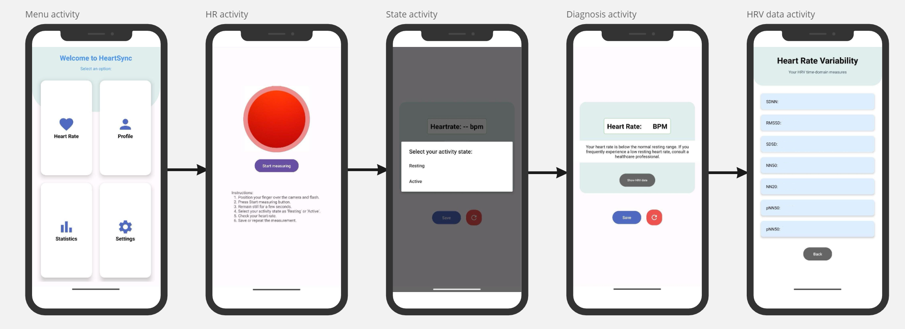

## Introduction
This project was developed as my **Final Degree Project (TFG)**, aiming to explore the potential of mobile applications in health monitoring.  
Cardiovascular diseases are a leading cause of death worldwide, making heart rate monitoring an essential health metric.  

In this project, I developed **HeartSync**, an Android application that allows users to measure both **heart rate (HR)** and **heart rate variability (HRV)** using just their smartphone’s camera and LED flash.

## How It Works
HeartSync utilizes **photoplethysmography (PPG)**, a technique that detects changes in blood volume by analyzing the light absorbed by the skin. The app:
- Captures light reflection from the user’s fingertip using the smartphone’s camera.
- Analyzes color intensity variations to extract HR and HRV data.
- Provides users with real-time feedback and data storage via **Firebase**.

## 📱 App Screens
Here’s an overview of the different screens in the HeartSync app:

## 🏥 How to Measure Heart Rate
The app measures heart rate using **photoplethysmography (PPG)**. The user places their fingertip over the smartphone’s camera, which detects variations in light absorption.

*Place your finger over the rear camera and flash.*

*Hold your phone still during the measurement process.*

## Key Features
- 📊 **HR & HRV Monitoring**: Measures **SDSD, RMSSD, SDNN, NN50, NN20, pNN50, and pNN20** for a detailed cardiac assessment.
- ☁ **Cloud Storage**: All measurements are securely stored in **Firebase**, allowing users to track trends over time.
- 📈 **Statistical Insights**: The app displays the **average and max heart rate** from the last 24 hours.
- 🏥 **Health-focused**: Aims to support **telemedicine** by offering an accessible and non-invasive solution for cardiac monitoring.

## Results & Future Improvements
HeartSync was tested against a **medical-grade pulse oximeter**, showing a strong correlation between both measurements. Future enhancements could include:
- Integrating **machine learning** for improved signal processing.
- Expanding to **iOS** to reach a broader audience.
- Adding AI-based **health insights**.

## Conclusion
With mobile technology becoming increasingly omnipresent, apps like **HeartSync** have the potential to revolutionize **remote health monitoring**. By leveraging **PPG and cloud storage**, we can empower individuals to take control of their heart health in an easy and accessible way.

**Keywords**: heart rate, heart rate variability, photoplethysmography, cardiac monitoring, mobile application, digital health.

---
